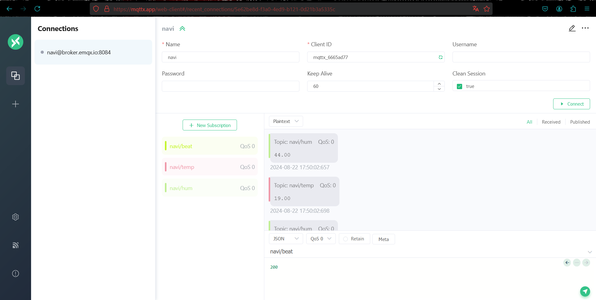
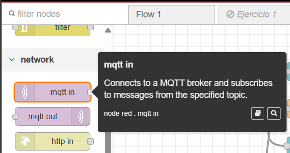
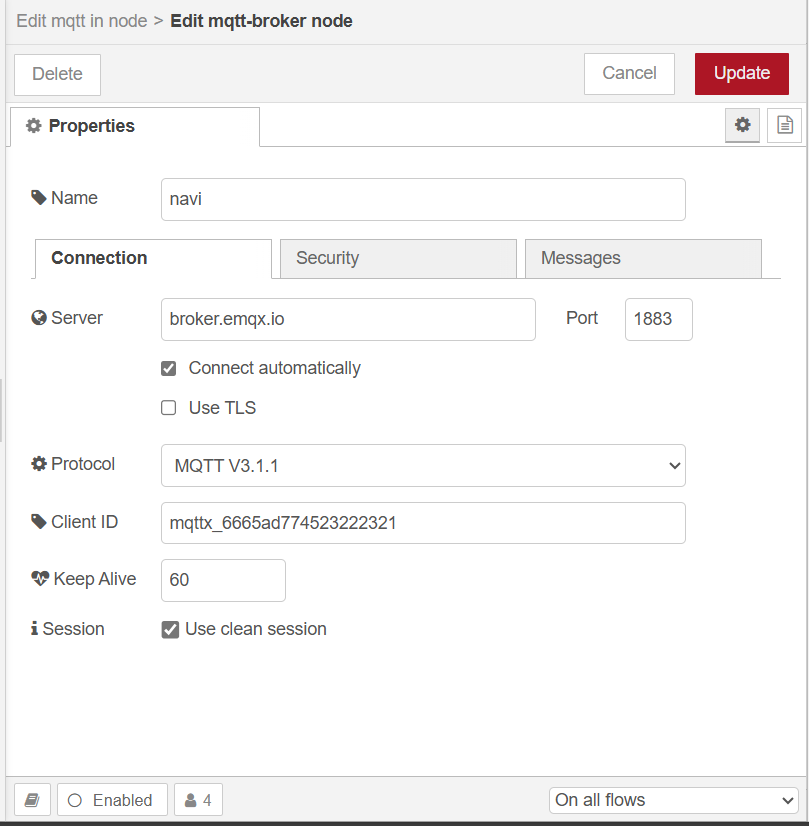
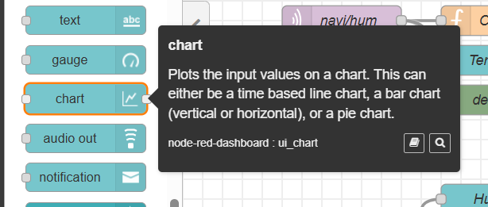
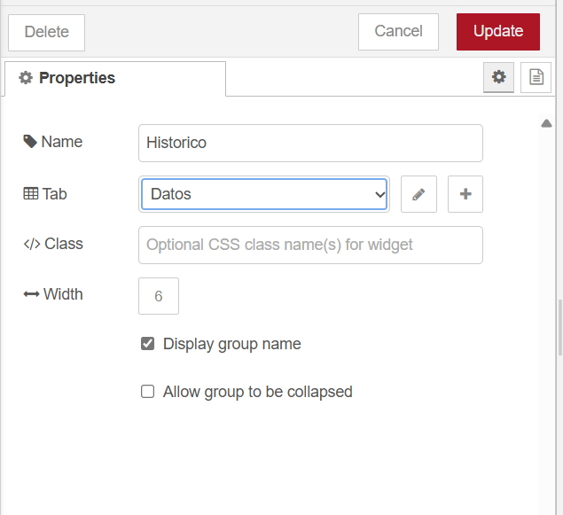
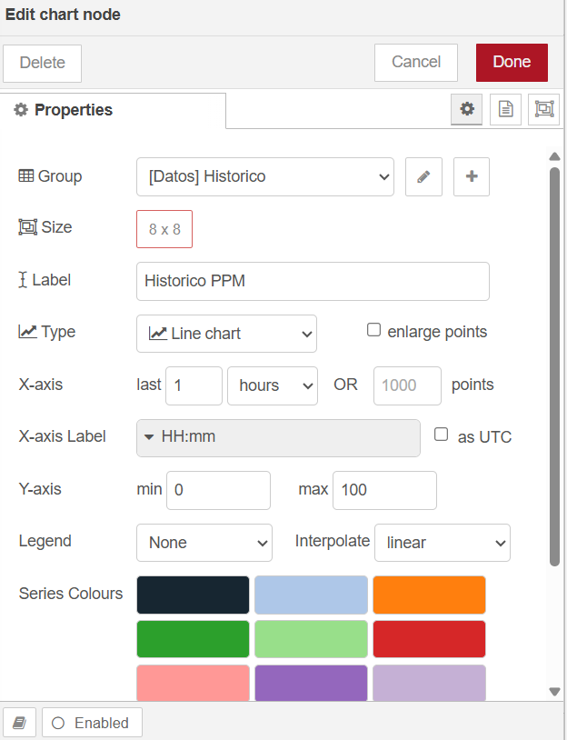
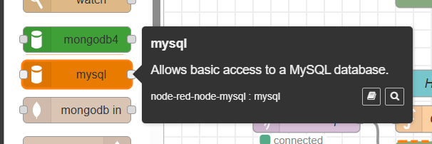
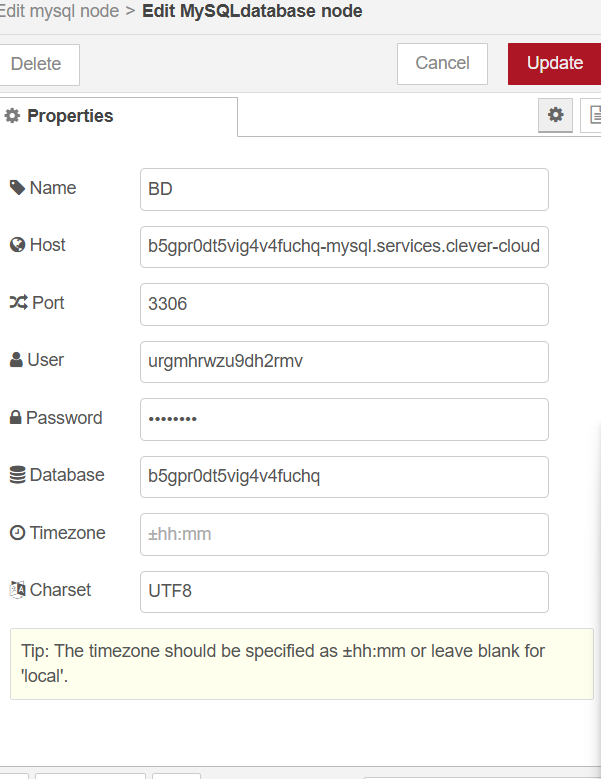
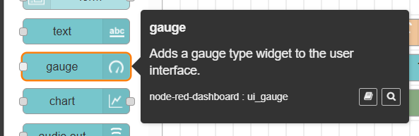
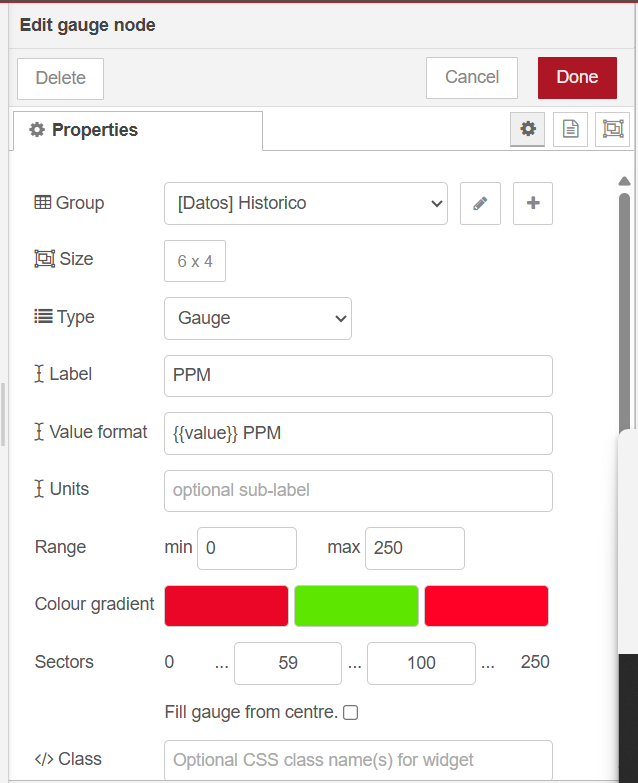

## Documentación Dashboard

Para la realización del dashboard usamos lo siguiente:
- Node-Red
- MySQL
- mqtt.app

Como primer paso realizamos la configuración del broker mqtt, para lo cual usamos un broker en línea con la ayuda de mqtt.app, el cual nos permite crear flujos de manera sencilla y rápida.

Después creamos el dashboard configurando nuestro flow, para ello usaremos un "mqtt in", este nodo "mqtt in" en Node-RED se utiliza para suscribirse a un topico específico en un broker MQTT y recibir mensajes que se publiquen en ese topico. Este nodo actúa como un cliente MQTT que escucha los mensajes entrantes y los introduce en el flujo de Node-RED para su posterior procesamiento:

Su configuración consiste en lo siguiente:

Como se muestra en la imagen anterior el nodo se configura mediante los siguientes datos:

- Server: En esta parte se coloca el servidor en el cual se encuentra el broker de mqtt, en nuestro caso es "broker.emqx.io" el cual está alojado en "mqtt.app".
- Protocolo: Este apartado lo dejamos por defecto.
- Client ID: En este caso deberás poner un id de cliente diferente al que tiene el broker en nuetro caso es "mqtt_6665ad774523222321".

Después agregamos un nuevo nodo para crear un histórico de datos:

Suconfiguracín se realizó de la siguiente manera:

Se creó un nuevo gropo el cual llamamos Historico/Datos como se muestra en la imagen anterior.
 

 
Como siguiente paso configuramos el nodo como en la imagen anterior:

 - Group: En el grupo usamos el que creamos anteriormente "[Datos]Historico".
 - Size: En el tamaño lo dejamos de 8x8 pero se puede elegir el tamaño que deseemos.
 - Label: Para la etiqueta en este caso usamos "Historico PPM" para saber que es un histórico de pulsaciones por minuto.

Para los siguiente usamos un nodo llamado mysql como se muestra en la imagen anterior y lo configuramos de la siguiente manera:

En nuestro caso usamos una base de datos en la nube pero se podría realizar de manera local.

Por último agregamos un nuevo nodo para poder ver los datos de una mejor manera y lo configuramos de la siguiente manera:

- Group: Selecciuonamos el grupo "[Datos]Historico" que creamos anteriormente.
- Size: Nosotros usamos 6x4 para nustra grafica.
- Type: Esta parte se queda igual.
- Label: En la etiqueta agregamos el nombre de la tabla o grafica.
- Value Format: Aquí lo dejamos por defalut solo agregamos "PPM"
- Units: Esta parte la dejamos por default.
- Range: Aquí seleccionamos los rangos minimo y máximo de datos que mostraremos.
- Coluor gradient: En esta parte agregamos los colores que queramos mostrar en nuestra grafica.
- Sectors: En esta parte agregamos los rangos de número los cuales activarán los diferentes colores que asignamos.

Para los diferentes flows restantes realizamos el mismo procedimiento, depende de lo que se quiera mostrar se realizan unos cambios pequeños.