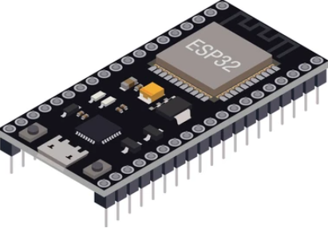
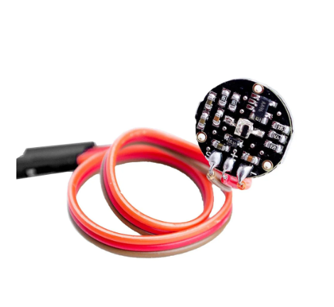
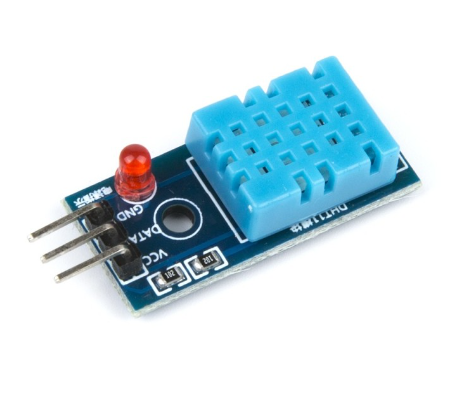
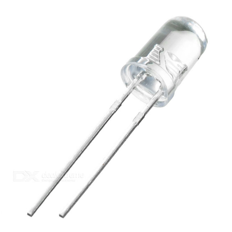

## Circuito

### Descripción del Circuito

Este proyecto utiliza un ESP32 como microcontrolador principal, al que se le han conectado varios sensores y dispositivos para monitorear el ritmo cardíaco, la temperatura y la humedad, además de un buzzer y una pantalla OLED para la visualización de los datos.

### Componentes Utilizados

- **ESP32**: Microcontrolador principal que gestiona las conexiones WiFi, el procesamiento de datos y la comunicación MQTT.

- **Sensor de Ritmo Cardíaco (HW-827)**: Conectado al pin 34 del ESP32, mide el ritmo cardíaco del usuario.

- **DHT11**: Sensor de temperatura y humedad conectado al pin 4 del ESP32.

- **Pantalla OLED (128x64, controlador SSD1306)**: Conectada vía I2C (SDA y SCL), muestra los valores de BPM, temperatura y humedad en tiempo real.

- **Buzzer**: Conectado al pin 14 del ESP32, emite una alerta sonora si el ritmo cardíaco excede los 100 BPM.

- **LED (opcional)**: Conectado al pin 13, parpadea con cada latido detectado.

### Esquema de Conexiones

- **ESP32 Pin 34**: Entrada analógica desde el sensor de ritmo cardíaco.
- **ESP32 Pin 4**: Conexión al sensor DHT11.
- **ESP32 Pin 14**: Conexión al buzzer.
- **ESP32 Pin 13**: Conexión al LED (parpadeo con cada latido).
- **I2C (SDA y SCL)**: Conexión a la pantalla OLED.

### Software

El software desarrollado incluye las siguientes funcionalidades:

1. **Conexión WiFi**: Configuración de la conexión WiFi utilizando las credenciales proporcionadas.
2. **Conexión MQTT**: Comunicación con un broker MQTT para enviar datos de ritmo cardíaco, temperatura y humedad.
3. **Monitoreo del Ritmo Cardíaco**: Utilizando la librería `PulseSensorPlayground` para leer los latidos por minuto (BPM).
4. **Monitoreo de Temperatura y Humedad**: Uso de la librería `DHT` para obtener valores de temperatura y humedad del sensor DHT11.
5. **Alertas y Visualización**: 
   - Si el BPM supera los 100, se activa el buzzer.
   - Los valores de BPM, temperatura y humedad se muestran en la pantalla OLED.
6. **Publicación en MQTT**: Publicación de los valores de BPM, temperatura y humedad en temas específicos del broker MQTT.

### Código Fuente

El código fuente desarrollado para este proyecto se encuentra en el archivo `ESP32.ino`. A continuación se incluye una breve descripción de las principales secciones del código:

- **setup_wifi()**: Configura y conecta el ESP32 a la red WiFi.
- **setup()**: Inicializa los sensores, la pantalla OLED, y configura la conexión al broker MQTT.
- **loop()**: 
  - Mantiene la conexión con el broker MQTT.
  - Lee y publica los valores de ritmo cardíaco, temperatura y humedad.
  - Controla la activación del buzzer según el ritmo cardíaco.
  - Actualiza la pantalla OLED con los valores actuales.

---

Para más detalles sobre el código o cómo configurar el hardware, consulta el archivo `README.md` en la raíz del repositorio o contacta con el equipo de desarrollo.
